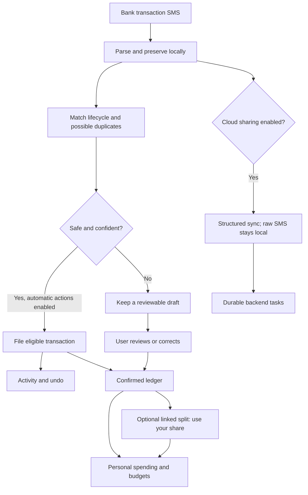
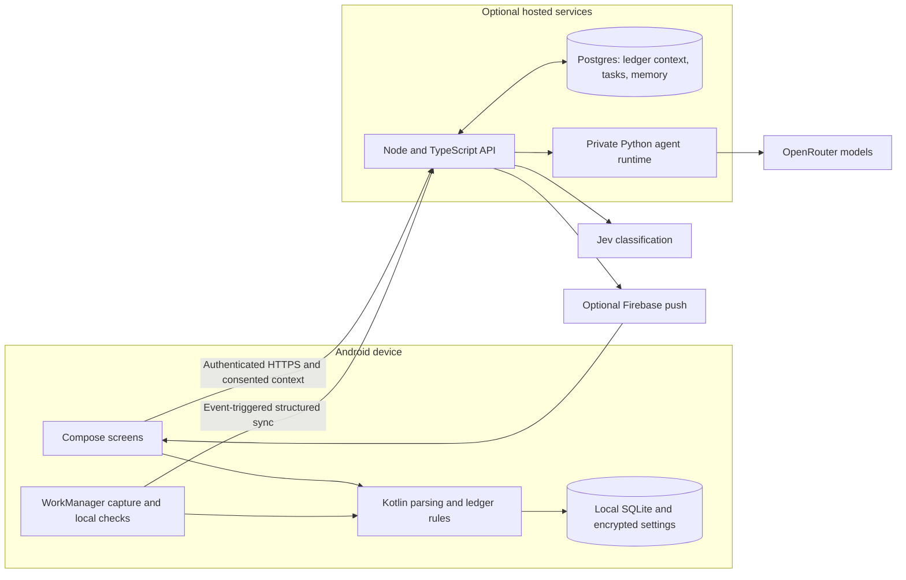

<div align="center">


# Neko

**A local-first Android finance app with a proactive personal agent.**

Capture payments. Understand your spending. Split bills. Give Neko responsibilities—without handing over your bank credentials.


[Explore the features](#features) · [Get started](#get-started) · [Understand the architecture](#architecture) · [Read the docs](#documentation)

</div>

---

## What is Neko?

Neko is a Kotlin Android app for personal finance, with an animated cat as its conversational interface. Its first domain is money: capturing bank transaction notices, maintaining a reviewable ledger, distinguishing personal spending from money movement, managing budgets, and tracking shared expenses.

The app is **local-first**. SMS parsing, statement imports, ledger calculations, bill splitting, and built-in alerts run on the phone. Optional cloud services add classification, conversation, summaries, persistent correction memory, and scheduled responsibilities.

**Proactive does not mean a model running forever.** Neko reacts to events and scheduled checks. The phone uses Android WorkManager; the backend stores durable tasks and runs them when its service is awake. Timing remains subject to Android, connectivity, and hosting constraints.

> **Current scope:** an Android app, a pure Kotlin domain module, a Node/TypeScript API, a private Python agent runtime, Postgres migrations, and a sample-data browser preview. The checked-in hosting implementation targets Fly.io—not a deployed Cloudflare Worker. Source configuration is not a guarantee that a particular hosted instance is current or available.

## Explore this README

| If you want to… | Start here |
| --- | --- |
| Understand what the app actually does | [Features](#features) and [A payment's journey](#a-payments-journey) |
| Try the app without cloud services | [Android app](#android-app) |
| Browse the visual concept | [Interactive browser preview](#interactive-browser-preview) |
| Run the API and agents | [Backend and agent runtime](#backend-and-agent-runtime) |
| Understand the money calculations | [Accounting and review](#accounting-and-review) |
| Understand data sharing and permissions | [Privacy and user control](#privacy-and-user-control) |
| Navigate the source | [Repository map](#repository-map) |
| Work on the project | [Development and verification](#development-and-verification) |
| Check what is not finished or guaranteed | [Boundaries and limitations](#boundaries-and-limitations) |

<details>
<summary><strong>Full navigation</strong></summary>

- [What is Neko?](#what-is-neko)
- [Features](#features)
- [A payment's journey](#a-payments-journey)
- [Accounting and review](#accounting-and-review)
- [Architecture](#architecture)
- [Agent behavior and learning](#agent-behavior-and-learning)
- [Get started](#get-started)
  - [Android app](#android-app)
  - [Interactive browser preview](#interactive-browser-preview)
  - [Backend and agent runtime](#backend-and-agent-runtime)
- [Configuration](#configuration)
- [Hosting and notifications](#hosting-and-notifications)
- [Privacy and user control](#privacy-and-user-control)
- [Repository map](#repository-map)
- [Development and verification](#development-and-verification)
- [Boundaries and limitations](#boundaries-and-limitations)
- [Documentation](#documentation)
- [FAQ](#faq)

</details>

## Features

### Your money, on your phone

| Capability | Implemented behavior |
| --- | --- |
| **Bank SMS capture** | Parses supported bank notices locally, ignores OTP/verification messages, and uses fingerprints and lifecycle matching to reduce duplicate records. |
| **Reviewable ledger** | Search, debit/credit/review filters, manual entries, editing, confirmation, and CSV export. Uncertain captures stay drafts. |
| **Statement imports** | On-device parsing of supported CSV/text, Excel, and text-based PDF statements; imported records participate in reconciliation and review. |
| **Personal spending** | Separates confirmed expenses from transfers, funding, refunds, reimbursements, and investment principal. Linked split payments count only your share. |
| **Budgets and insights** | Monthly/category budgets, spending breakdowns, budget pacing, and incomplete-coverage notices. |
| **Confident actions** | Learns categories from confirmed history and known merchant types. Eligible automatic category/confirmation actions appear in Activity with undo. |
| **Local check-ins** | Evening digest, unusual-payment alerts, and budget alerts at 80% and 100%, without a backend or paid AI. |
| **UPI handoff** | Scan or enter payment details and continue in a UPI app. Personal UPI IDs are copied before opening the payment app. Neko does not execute payments itself. |
| **Appearance** | Jetpack Compose UI, light/dark/system themes, and reduced-motion controls. |

<details>
<summary><strong>Supported bank capture and statement formats</strong></summary>

The SMS parser contains registered-sender rules for **ICICI, IDFC FIRST, AU, HDFC, SBI, Axis, and Kotak**. This is a specific parser, not a promise to recognize every message from every bank.

Live capture is supplemented by inbox catch-up and a manual historical scan. SMS access requires Android permissions and a device with relevant messages. Unsupported or conflicting transaction details remain reviewable rather than becoming silently trusted entries.

Statement import supports several CSV/TSV/text and spreadsheet layouts, `.xlsx`, `.xls`, HTML/XML table exports, and text PDFs, including a supplied PDF password. Files are parsed on-device with an 8 MiB input limit. Scanned-image PDFs need OCR, which is not implemented; unsupported layouts or protected workbooks can fail.

Sources: [SMS parser](core/src/main/kotlin/dev/neko/core/SmsParser.kt), [statement reader](app/src/main/kotlin/dev/neko/app/data/StatementReader.kt), [capture workers](app/src/main/kotlin/dev/neko/app/capture/).

</details>

### Shared expenses, without a required shared account

The **Splits** tab is a local bill-splitting ledger:

- People and groups, with any participant as payer.
- Equal, exact-amount, percentage, and share-based allocation.
- Balances, suggested simplified settlements, and settle-ups in either direction.
- Expense editing, notes, dates, categories, weekly/monthly repeats, and shareable reminder text.
- Prompts for today's unasked payments when the app opens.
- Bank-payment links that update `personal_share_paise` for reporting and cloud context.

**A local split is not a live shared expense.** Other people do not automatically receive or synchronize local records. Settle-ups record debts; they do not move money.

<details>
<summary><strong>What about Splitwise?</strong></summary>

Settings includes a direct-on-phone Splitwise connection. The credential is stored in encrypted Android settings rather than uploaded to Neko's backend. Repository code supports refresh and guarded expense-posting operations.

However, the current Splits screen manages **local** people, groups, and expenses. Remote expense-management and cloud-group methods are not a complete user-facing collaborative workflow. You do not need a Splitwise API key to use local splits.

Sources: [Splits screen](app/src/main/kotlin/dev/neko/app/ui/SplitsScreen.kt), [split arithmetic](core/src/main/kotlin/dev/neko/core/Splits.kt), [Splitwise repository](app/src/main/kotlin/dev/neko/app/data/SplitwiseRepository.kt).

</details>

### Optional cloud intelligence

| Capability | How it works |
| --- | --- |
| **Classification** | Jev supplies structured category suggestions; uncertain results stay reviewable. |
| **Chat and summaries** | A focused agent receives consented structured ledger context and uses OpenRouter. |
| **Responsibilities** | Authorized backend schedules create durable follow-up tasks, including while the Android app is closed. |
| **Correction memory** | Explicit corrections are stored per user and consulted on later relevant tasks. |
| **Cost controls** | Paid-AI switch, monthly budget, daily request limit, per-turn allowance, bounded model calls, and provider price ceilings. |
| **Push updates** | Optional Firebase Cloud Messaging; results are also retrieved through the app. |

## A payment's journey



A captured notice, a confirmed ledger entry, and derived personal spending are separate concepts. Neko preserves that distinction so a payment is not automatically treated as trustworthy spending just because it was detected.

## Accounting and review

Amounts are represented in **integer paise**, not floating-point rupees. Reports use INR and India-local reporting dates.

- Posted, confirmed, non-transfer entries drive the ledger's spending reports.
- Draft, pending, failed, and reversed records are excluded.
- Own-account transfers and funding movements are not ordinary expenses or income.
- Refunds and reimbursements offset spending only through explicit confirmed expense links, with caps to prevent over-offsetting.
- Splitting a bank payment replaces its full expense contribution with the user's personal share.
- Investment principal and investment gains are treated separately.
- Statement coverage warnings communicate missing evidence; an imported account/month is not proof of a complete bank audit.

<details>
<summary><strong>Example: pay ₹1,200 for three people</strong></summary>

If you pay ₹1,200 and split it equally among yourself and two friends:

| View | Amount |
| --- | ---: |
| Captured bank payment | ₹1,200 |
| Your personal spending | ₹400 |
| Total owed back by friends | ₹800 |

The bank payment remains intact for auditability. The split records your share separately. Repayment of the already-excluded friends' shares must not reduce your personal spending a second time.

Sources: [ledger rules](core/src/main/kotlin/dev/neko/core/Ledger.kt), [local repository](app/src/main/kotlin/dev/neko/app/data/LedgerRepository.kt), [split-share migration](backend/migrations/005_split_share.sql).

</details>

## Architecture



| Layer | Responsibility | Stack |
| --- | --- | --- |
| `app/` | Native UI, capture, device persistence, integrations, background work | Kotlin, Compose/Material 3, SQLite, WorkManager, OkHttp |
| `core/` | Parsing, accounting, budgets, splits, transfers, privacy rules | Kotlin/JVM, Java 17 |
| `backend/` | Authentication, sync, API, durable jobs, consent, costs, migrations | Node.js, TypeScript, Postgres |
| `agent-service/` | Bounded specialist execution and model routing | Python, FastAPI, LangGraph, Nanobot |
| `preview/` | Interactive visual demonstration, not the production app | Static HTML, CSS, JavaScript |
| `deploy/` | Starts and supervises the API and private agent process | Python supervisor, Docker, Fly.io configuration |

The main Docker image runs both services. The API is exposed on **8080**; the agent listens on **127.0.0.1:8081**. Durable cloud state lives in Postgres, not a Fly volume.

## Agent behavior and learning

Neko uses focused task agents rather than giving every task unrestricted access:

| Specialist | Focus |
| --- | --- |
| Ledger | Review and draft category changes |
| Budget | Budget progress and spending context |
| Summary | Spending, income, and reimbursements |
| Follow-up | Authorized scheduled checks |
| Chat | General finance conversation |
| Classification | Structured category decisions through Jev |

One specialist runs per task. Chat proposals require confirmation. Saved preferences do not grant additional tool permissions.

<details>
<summary><strong>Automatic actions versus proposals</strong></summary>

On-device history and known merchant types can support eligible automatic filing. Safety checks include posted status, identified account, possible duplicates, unusual amounts, and transfer-like payments. Money received stays reviewable unless the payer has already been learned as income.

Cloud category confidence of **85% or higher** can support an automatic category update when enabled; local safety checks still govern confirmation. Automatic category/confirmation actions are logged with undo. You can turn this behavior off in **Settings → Let Neko act on its own**.

Chat-generated ledger changes remain proposals until confirmed. Transfer reconciliation has a separate unlink operation; not every background reconciliation action is covered by the category-autopilot switch.

</details>

<details>
<summary><strong>Teach Neko a correction</strong></summary>

In chat, use explicit commands such as:

```text
Remember for next time: Only mention a budget alert at 90 percent.
Show learned rules
Forget rule: <rule ID>
```

A complaint without a clear replacement rule is not enough to establish a new preference. Saved corrections are durable, user-scoped cloud memory—not model retraining and not a guarantee against future errors. The implementation limits memory to 30 rules and 1,000 characters per correction.

The authenticated corrections API supports listing, explicitly confirmed creation, and deletion under `/v1/agent/corrections`. Rules can apply globally or to a particular task scope. See [agent learning](docs/agent-learning.md).

</details>

<details>
<summary><strong>Model selection and cost boundaries</strong></summary>

With `auto`, the runtime obtains a bounded shortlist of eligible paid, tool-capable OpenRouter text models. Jev selects a low-cost suitable candidate; a fallback is used if selection fails. Manual model selection remains available.

Each task allows at most three generation calls, with up to 4,096 output tokens per call. The backend reserves a turn allowance before execution and records reported usage. Timeouts can consume the reservation conservatively because a provider may already have billed.

The example configuration sets a **$2 monthly AI budget**, **100 daily AI requests**, and a **$0.06 turn allowance**. These are application controls, not a hosting allowance or an unconditional provider billing guarantee. Set an OpenRouter key/account spending limit too.

See [model routing](docs/model-routing.md) for the selection rules, reference candidates, failure behavior, and data sent to the router.

</details>

## Get started

Choose the smallest path you need:

| Path | Needs | Gives you |
| --- | --- | --- |
| Android, local-only | Android toolchain and device/emulator | Capture, ledger, statements, local budgets/alerts, splits |
| Browser preview | Python and a browser | Interactive sample screens; no real accounts or AI |
| Full stack | Android plus Node, Python, Postgres, and private configuration | Optional authenticated cloud context, AI, and responsibilities |

### Android app

**Requirements:** Android 8.0+ device or emulator, JDK 17, Gradle 8.13, Android SDK 36, and internet access for build dependencies. The project uses Kotlin 2.2.21 and Android Gradle Plugin 8.13.2. The build version is 0.3.1.

#### Windows setup

Run from the repository root in PowerShell:

```powershell
python tools/setup_android.py
.\gradlew.bat :app:assembleDebug
```

The setup script downloads project-local tools into `.tools/`, accepts Android SDK licenses, and writes `local.properties`. It does not install an emulator image. Use Python 3.9+ for this bootstrap; the agent runtime uses Python 3.12.

With an authorized Android device or running emulator:

```powershell
.\.tools\android-sdk\platform-tools\adb.exe devices -l
.\gradlew.bat :app:installDebug
.\.tools\android-sdk\platform-tools\adb.exe shell am start -n dev.neko.app/.MainActivity
```

The debug APK's standard output location is `app/build/outputs/apk/debug/app-debug.apk`.

Choose **Try local features first** at onboarding. Grant SMS and notification permissions only for the features you want; manual ledger and splitting do not require cloud setup.

<details>
<summary><strong>Android Studio, macOS, and Linux</strong></summary>

Open the root project in Android Studio. Configure a compatible JDK/Gradle installation, SDK platform 36 and build-tools 36.0.0, and the SDK location in `local.properties`.

**Important:** `gradlew.bat` is a custom Windows launcher, not a standard Gradle wrapper. It expects `.tools/gradle-8.13`. There is no checked-in Unix `./gradlew` wrapper; on macOS/Linux use your own Gradle 8.13 installation, for example `gradle :app:assembleDebug`.

The Windows launcher respects an existing `JAVA_HOME` but sets `GRADLE_USER_HOME` to the repository's `.gradle/` directory. If a cloud-synced workspace causes cache locks, invoke the actual Gradle executable directly with a cache outside that workspace.

</details>

### Interactive browser preview

From the repository root:

```sh
python -m http.server 4173 --bind 127.0.0.1 --directory preview
```

Open **http://127.0.0.1:4173/**. Use the screen selector, theme toggle, sample ledger, and demo chat to explore the interface.

> The preview uses sample data and scripted responses. It does not connect to a bank, Postgres, OpenRouter, or Splitwise. Some preview copy represents earlier design concepts; it is not the authority for current Android integration behavior.

### Backend and agent runtime

Use **Node.js 22**, **Python 3.12**, and a Postgres database. Neon is the configured database option; migrations use standard Postgres connections.

1. Copy [`.env.example`](.env.example) to a private root `.env`.
2. Configure your database URL and independent secrets. Never reuse the placeholder values.
3. Install, build, and migrate from `backend/`:

```sh
npm ci
npm run build
npm run db:migrate
```

The migration command loads the root `.env`. It applies the schema, spending-policy, correction-memory, budget-plan, and split-share migrations. Run it before starting a new or updated backend.

<details>
<summary><strong>Generate the private secret values</strong></summary>

Run these locally and copy each generated value into your private environment configuration:

```sh
python -c "import secrets; print(secrets.token_urlsafe(32))"
python -c "import secrets; print(secrets.token_hex(32))"
```

Generate separate URL-safe values for `NEKO_PAIRING_SECRET` and `AGENT_SERVICE_TOKEN`. Use the **64-character lowercase hexadecimal** value for `MODEL_KEY_ENCRYPTION_KEY`.

Keep the encryption key stable and private: it is needed to decrypt stored user model keys. Do not paste secrets into issues, screenshots, or the browser preview.

**Template caveat:** `.env.example` currently describes the encryption key as base64, but the implemented backend requires lowercase hex. Follow the format above; a base64 value will prevent model-key storage.

</details>

#### Run the combined services with Docker

After migrating, return to the repository root:

```sh
docker build -t neko .
docker run --rm --env-file .env -p 127.0.0.1:8080:8080 neko
```

The container supervises both services and keeps the Python agent internal. In another terminal:

```sh
curl http://127.0.0.1:8080/health
```

A health response proves the exposed process responds; it does not prove registration, database writes, push delivery, or paid model execution.

**Android connections require HTTPS.** The app rejects cleartext HTTP. To connect a phone to a local backend, provide an HTTPS development endpoint or deploy it with TLS; pointing the app at `http://localhost:8080` is not sufficient. Set `NEKO_BACKEND_URL` before building or enter the HTTPS endpoint in the app.

Register with your private registration code, sign in, then enable cloud sharing and enter your own OpenRouter key only if you want AI features.

## Configuration

The authoritative template is [`.env.example`](.env.example). Do not commit a real `.env`.

| Variable | Purpose |
| --- | --- |
| `NEKO_BACKEND_URL` | HTTPS API URL used as the Android build's default endpoint |
| `DATABASE_URL` | Postgres connection for durable backend state |
| `DATABASE_URL_UNPOOLED` | Optional direct connection override for migrations |
| `NEON_BRANCH` | Database-branch metadata in the environment template |
| `NEKO_PAIRING_SECRET` | Private registration/pairing code |
| `MODEL_KEY_ENCRYPTION_KEY` | 32-byte key encoded as 64 lowercase hex characters for encrypted user model credentials |
| `AGENT_SERVICE_TOKEN` | Shared authentication secret between API and private runtime |
| `AGENT_SERVICE_URL` | Private agent address; default local topology uses `http://127.0.0.1:8081` |
| `CHAT_MODELS` / `CLASSIFIER_MODEL` | Allowed chat choices and classification model |
| `ALLOW_PAID_AI` | Server-side paid-AI gate |
| `MONTHLY_AI_BUDGET_USD` | Monthly application AI budget |
| `DAILY_AI_REQUESTS` | Daily application request limit |
| `AI_TURN_BUDGET_USD` | Per-turn AI allowance |
| `FCM_PROJECT_ID`, `FCM_CLIENT_EMAIL`, `FCM_PRIVATE_KEY` | Optional server push credentials |

**OpenRouter is per-user BYOK:** users enter keys through the Android app. The backend encrypts them; a shared model key is not bundled into the APK.

## Hosting and notifications

The checked-in [Fly configuration](fly.toml) exposes the Node API over HTTPS and allows the machine to stop while idle. The [root Dockerfile](Dockerfile) builds the API and private Python runtime into one image.

Before deploying, replace the placeholder app name in `fly.toml`, provision your database, apply migrations, and set the required secrets in your own provider account. The hosting documents describe an existing project environment; do not assume its identifiers belong to your deployment.

<details>
<summary><strong>How closed-app checks work</strong></summary>

The backend checks queued and due work at startup and once per minute while running. Tasks remain in Postgres across restarts.

When the Fly machine is stopped, it cannot execute a scheduled check. An API request can wake it. The repository also includes a [GitHub Actions wake workflow](.github/workflows/wake-agent.yml), scheduled at minutes 7 and 37 each hour. Set its `NEKO_WAKE_URL` repository secret to your deployment's HTTPS health URL.

This is approximate scheduling, not an exact-time guarantee. GitHub schedules can be delayed, and phone-side jobs remain subject to Android background restrictions. Force-stopping Android pauses background work until the app is reopened.

</details>

<details>
<summary><strong>Firebase push and preview hosting</strong></summary>

For Android push, register package `dev.neko.app` and place your configuration in `app/google-services.json`. The Gradle plugin is applied only when this ignored file exists, so source builds can work without Firebase.

Server-originated push additionally needs the backend FCM credentials, a synced device token, and Android notification permission. Without configured push, cloud results remain available when the app fetches Activity.

Firebase Hosting is for the **static preview**, not the agent runtime. The checked-in config points at a prepared `.tools/firebase-hosting` directory, not directly at `preview/`. Prepare sanitized assets and use your own Firebase project/site before deploying. Never host the repository root or service-account credentials.

See [Firebase setup](docs/firebase-setup.md).

</details>

**Costs:** scale-to-zero is a cost-control strategy, not a promise of free hosting. Active compute, stopped-machine storage, database usage, network traffic, and model calls can still incur charges. [Hosting options](docs/hosting-options.md) separates researched allowances and tradeoffs; verify current provider pricing before deployment.

## Privacy and user control

| Data or action | Boundary |
| --- | --- |
| Raw transaction SMS | Parsed and preserved on-device; not uploaded in structured cloud sync |
| Imported statement files/passwords | Used by local parsing; not sent to the agent |
| Local ledger, chats, splits | Stored in app-private SQLite; the entire database is **not** encrypted |
| Sensitive settings and raw SMS payloads | Protected with Android Keystore-backed encryption |
| Cloud context | Optional bounded structured transaction/budget context; identifiers are reduced, not guaranteed anonymous |
| Chat questions and learned corrections | Cloud data when those features are used; relevant context reaches the selected provider |
| OpenRouter key | Sent over HTTPS to encrypted backend storage and supplied to the private runtime for model calls |
| Splitwise key | Encrypted on the phone for direct Splitwise requests |
| UPI payments | Completed by the user in an external UPI app; no bank password, PIN, or OTP collection |
| CSV exports, reminders, clipboard | Explicit device-sharing surfaces under user control |

You can disable cloud AI, delete saved cloud context, inspect/forget learned rules, and disable confident category actions. Deleting backend context cannot recall data already sent to a provider. Local notifications can include amounts and merchants; Android notification visibility and permission settings matter.

**Pause is not a privacy off-switch:** it suppresses several check/sync paths, but live SMS capture can still occur. Use Android SMS permissions to control access to messages.

## Repository map

```text
Neko/
├── app/                    Native Android application
│   └── src/main/           Compose UI, device data, SMS capture, jobs
├── core/                   Pure Kotlin domain logic and tests
├── backend/
│   ├── src/                API, auth, database, AI controls, scheduler
│   ├── migrations/         Postgres schema and feature migrations
│   └── test/               Backend regression tests
├── agent-service/
│   ├── neko_agent/         Private FastAPI runtime and specialists
│   └── tests/              Runtime, routing, permission, cost tests
├── preview/                Sample-data browser interface and mascot assets
├── deploy/                 Combined-service process supervisor
├── docs/                   Architecture, setup, routing, learning, research
├── tools/                  Local toolchain, art, and deployment helpers
├── .github/workflows/      Scheduled backend wake workflow
├── Dockerfile              Combined API/agent container
├── fly.toml                Fly.io deployment template
├── firebase.json           Static preview hosting configuration
├── .env.example            Shareable configuration template
└── README.md               Project entry point
```

<details>
<summary><strong>Useful source entry points</strong></summary>

| Area | Start reading |
| --- | --- |
| Android startup | [MainActivity](app/src/main/kotlin/dev/neko/app/MainActivity.kt), [NekoApplication](app/src/main/kotlin/dev/neko/app/NekoApplication.kt) |
| Screens and navigation | [NekoApp](app/src/main/kotlin/dev/neko/app/ui/NekoApp.kt), [UI directory](app/src/main/kotlin/dev/neko/app/ui/) |
| State and actions | [NekoViewModel](app/src/main/kotlin/dev/neko/app/ui/NekoViewModel.kt) |
| Local capture/reconciliation | [LedgerRepository](app/src/main/kotlin/dev/neko/app/data/LedgerRepository.kt) |
| Money and reporting | [Ledger](core/src/main/kotlin/dev/neko/core/Ledger.kt) |
| Confident filing and checks | [Autopilot](core/src/main/kotlin/dev/neko/core/Autopilot.kt), [Android jobs](app/src/main/kotlin/dev/neko/app/agent/) |
| Splits and balances | [Splits](core/src/main/kotlin/dev/neko/core/Splits.kt) |
| API entry points | [index.ts](backend/src/index.ts), [server.ts](backend/src/server.ts) |
| Database setup | [migrate.ts](backend/src/migrate.ts), [migrations](backend/migrations/) |
| Private agent execution | [server.py](agent-service/neko_agent/server.py), [runtime.py](agent-service/neko_agent/runtime.py) |

</details>

## Development and verification

These are contributor commands, **not a claim that every suite or deployment has been verified for your environment**.

<details open>
<summary><strong>Android and Kotlin checks</strong></summary>

From the repository root after toolchain setup:

```powershell
.\gradlew.bat :core:test
.\gradlew.bat :app:assembleDebug
.\gradlew.bat :app:compileDebugAndroidTestKotlin
.\gradlew.bat :app:lintDebug
```

For actual Compose instrumentation, use a connected device or compatible emulator:

```powershell
.\gradlew.bat :app:connectedDebugAndroidTest
```

Core tests exercise parsing, accounting, reconciliation, budget rules, splits, transfers, UPI, and privacy boundaries. Instrumentation compilation is not equivalent to running UI tests on a device.

</details>

<details>
<summary><strong>Backend checks</strong></summary>

From `backend/`, after `npm ci`:

```sh
npm run check
node --env-file=.env.test node_modules/vitest/vitest.mjs run
npm run build
```

Create a private `backend/.env.test` with `DATABASE_URL` pointing to an **isolated test database or branch**, never production. The integration suite runs migrations and writes persistent test data; it does not fully clean up its accounts and records. Plain `npm test` instead requires that test database environment to be exported already.

`npm run dev` builds once and starts the API with the root `.env`; it is not a file-watching development server. Start the private agent separately with matching configuration if using this path instead of the combined container.

</details>

<details>
<summary><strong>Python agent checks</strong></summary>

Use Python 3.12 and an isolated virtual environment. From `agent-service/`:

```sh
python -m pip install -r requirements.txt
python -m pytest
```

`requirements.txt` includes the test dependency. The combined production image uses `requirements-runtime.txt`.

</details>

<details>
<summary><strong>Optional authenticated deployment smoke check</strong></summary>

After configuring your private HTTPS deployment and installing backend dependencies, run from the root:

```sh
node --env-file=.env tools/verify_deployment.mjs
```

This helper creates a synthetic account, verifies registration and correction save/list/delete, and attempts to remove the account afterward. It writes to the configured deployment database; use only an environment you control. It makes no paid model calls and does not prove live generation or push delivery. A reported cleanup failure needs attention.

</details>

## Boundaries and limitations

- **Android only:** no iOS app is included.
- **No universal bank connection:** SMS and local statements are the implemented capture paths; Account Aggregator integration is pending.
- **No exact-time background guarantee:** WorkManager, OEM policies, machine sleep, and workflow delays affect delivery.
- **No autonomous money transfer:** UPI handoff and debt records still require the user to complete payments.
- **Local splits are not collaborative sync:** remote Splitwise/cloud-group plumbing does not equal a complete shared-expense UI.
- **Repeats and reminders have limits:** repeating split expenses materialize on app reload; reminders are shareable text, not an always-running payment/reminder service.
- **No OCR:** scanned statements and unsupported layouts need another capture route.
- **Coverage is not an audit:** account/month coverage markers can be satisfied by partial imports; the cloud sync is bounded rather than a full replica of every local record.
- **No blanket encryption claim:** Keystore protects selected secrets and raw payloads, not all SQLite financial data.
- **No perfect-model promise:** confidence thresholds, review, bounded tools, and correction memory reduce risk but cannot eliminate mistakes.

## Documentation

| Document | What it explains |
| --- | --- |
| [Agent learning](docs/agent-learning.md) | Correction commands/API, scopes, specialist permissions, local learning |
| [Model routing](docs/model-routing.md) | Trigger-to-answer flow, Jev selection, limits, provider disclosure |
| [Fly architecture](docs/fly-agent-architecture.md) | Event-driven sync, durable tasks, private runtime, scale-to-zero tradeoffs |
| [Firebase setup](docs/firebase-setup.md) | Android push configuration, backend secrets, static preview deployment |
| [Hosting options](docs/hosting-options.md) | Researched alternatives, allowances, costs, and tradeoffs |
| [Design notes](DESIGN.md) | Visual direction and interface rationale |
| [Bug-hunt record](docs/bug-hunt-2026-10-03.md) | Historical findings, checks, and known limitations—not a current CI badge |

Personal instructions, private spending policy, local environment files, credentials, generated APKs, and local tooling caches are intentionally excluded by [`.gitignore`](.gitignore). Review source, documents, images, and configuration before changing repository visibility.

## FAQ

<details>
<summary><strong>Can I use Neko without a backend or OpenRouter key?</strong></summary>

Yes. Choose local mode. Capture, manual ledger entries, supported statement imports, local budgets/checks, UPI handoff, and bill splitting do not require cloud AI. Cloud conversation, classification, correction memory, and hosted responsibilities do.

</details>

<details>
<summary><strong>Does “always-on” mean my phone runs an AI model constantly?</strong></summary>

No. Events and scheduled work trigger bounded tasks. Durable state keeps responsibilities across sessions, but background execution remains subject to device and hosting availability.

</details>

<details>
<summary><strong>Will Neko confirm every transaction automatically?</strong></summary>

No. Eligible confident captures can be filed automatically when enabled. Uncertain, unusual, duplicate-like, transfer-like, and unfamiliar incoming-money captures stay reviewable. Chat proposals still need confirmation.

</details>

<details>
<summary><strong>Is the web preview the real app?</strong></summary>

No. It is an interactive sample-data design preview. The Android application and optional authenticated services implement the real behavior.

</details>

<details>
<summary><strong>Is this guaranteed free to run?</strong></summary>

No. Local-only use avoids model/backend charges, but build and device requirements remain. Optional hosting and provider calls have separate costs; application budgets do not replace provider spending limits.

</details>

<details>
<summary><strong>Can I reuse or redistribute the project?</strong></summary>

No license file is currently included at the repository root. Do not assume an open-source redistribution license; clarify permission with the repository owner.

</details>

---

<div align="center">

**Local capture. Reviewable decisions. Optional intelligence.**

[Back to top](#neko)

</div>
