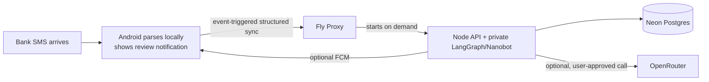

# Neko on Fly.io

Local agent changes now include durable correction memory and focused task agents;
see [Corrections and focused agents](agent-learning.md). Apply migration 003 and
deploy the updated runtime before expecting those changes on the hosted service.

Neko is deployed at `https://neko-teerth.fly.dev` in Singapore (`sin`). The app is configured to scale to zero while idle and start on an incoming API request.

The phone does not poll the server. It enqueues a one-time, network-constrained WorkManager sync after SMS capture and for explicit app events. Local parsing and the transaction review notification happen on-device before cloud sync. On upgraded installs, app startup cancels the previous 15-minute periodic sync. Fly's `auto_stop_machines = "stop"`, `auto_start_machines = true`, and `min_machines_running = 0` allow the API machine to stop after several idle minutes and wake for a later request. The first request after idle can pay a cold-start delay; Android WorkManager can retry failed syncs, while Android's permission, connectivity, battery, and background scheduling rules still apply.

The Node service checks queued work and due scheduled agent tasks at startup and once per minute while its Machine is running. This does not run while the Machine is stopped: scheduled work catches up on the next API wake. Durable queue and ledger state live in Neon so restarts do not lose work. The Python agent service listens only on `127.0.0.1:8081`; Fly exposes only the Node API on port 8080. No persistent Fly volume is attached.

Fly does not charge CPU or RAM for stopped Machines, but does charge for the Machine root filesystem: currently $0.15 per GB for 30 days stopped. Active-request compute, Neon, network egress, and paid OpenRouter model calls may still cost money. See [Fly Machine autostop/autostart](https://docs.fly.io/launch/autostop-autostart) and [Fly resource pricing](https://docs.fly.io/about/pricing/).

Fly secrets: `DATABASE_URL`, `NEKO_PAIRING_SECRET`, `MODEL_KEY_ENCRYPTION_KEY`, and `AGENT_SERVICE_TOKEN`. Do not set a shared `OPENROUTER_API_KEY`: each user's BYOK key is encrypted with `MODEL_KEY_ENCRYPTION_KEY` and passed only to the private local agent for that request. Configure `FCM_PROJECT_ID`, `FCM_CLIENT_EMAIL`, and `FCM_PRIVATE_KEY` only when enabling server-originated push.
